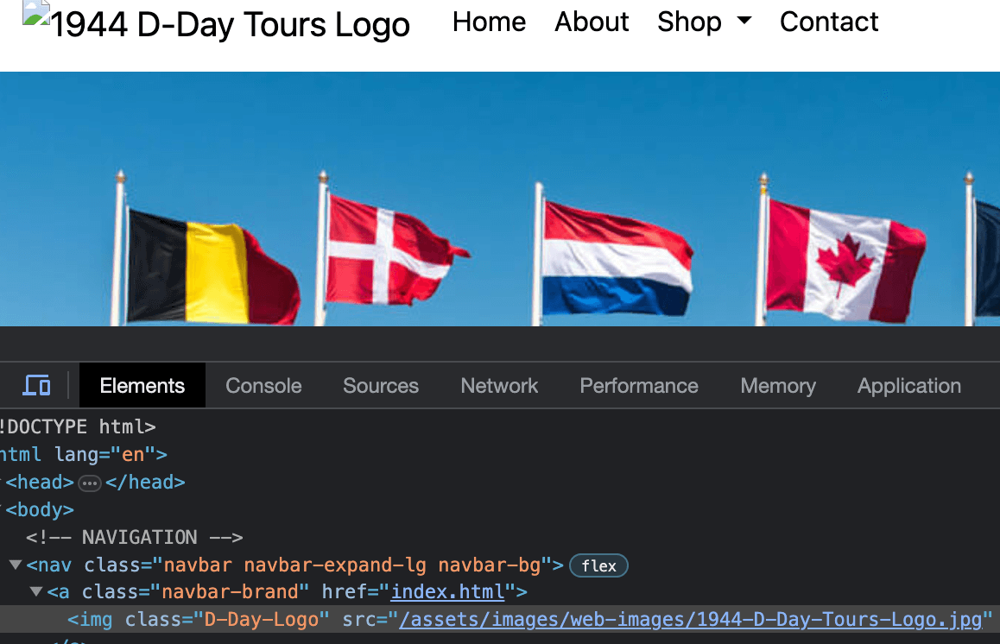
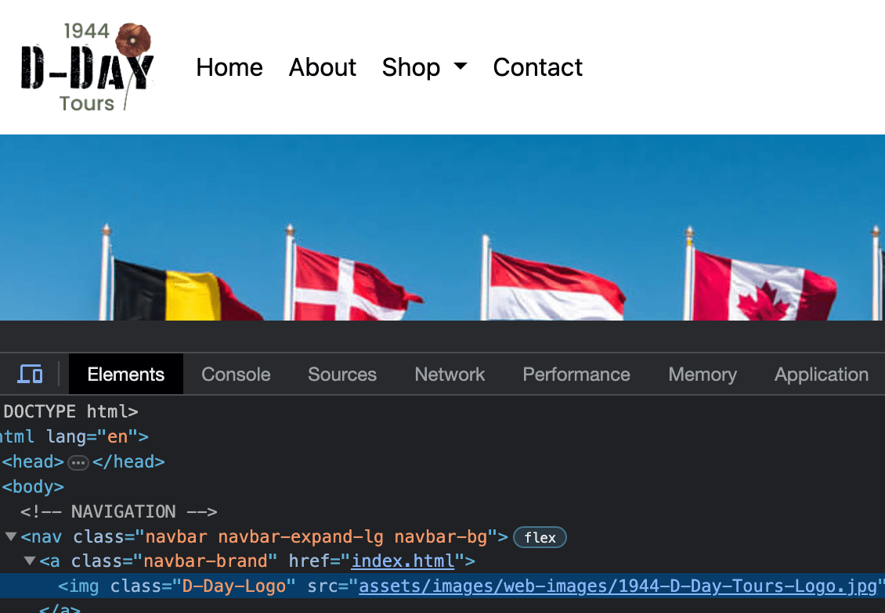

# 1944 D-Day Tours

## Showcase

A deployed live version of my D1944 D-Day Tours website can be found [here](https://andrewh1188.github.io/1944_D-Day_Tours/)

This domain link will allow you to access my live deployed website for my 1944 D-Day Tours. I created 1944 D-Day Tours originally in WordPress on another mini bootcamp that I enrolled in and completed. I wanted to have a challenge of replicating my WordPress site by coding it and so took on this challenge. I hope you like this ficticious tour company as much as I do, and did when designing and coding this and all that you see online.

## Table of Contents
1. [User Experience UX](#user-experience-ux)
    * [User Stories](#user-stories)
    * [As a new / first time user](#new-first-time-user)
    * [Returning Visitor Goals](#returning-visitor-goals)
    * [Frequent User Goals](#frequent-user-goals)
    * [User Customer Goals](#user-goals)
    * [Business Goals](#business-goals)
2. [Construction Planes](#construction-planes)
    * [Strategy](#strategy)
    * [Scope](#scope)
    * [Structure](#structure)
    * [Skeleton](#skeleton)
    * [Surface](#surface)
3. [Design](#design)
    * [Imagery](#imagery)
    * [Wireframes](#wireframes)
    * [Entity-relationship-planner](#entity-relationship-planner)
4. [Features](#features)
    * [Existing-features](#existing-features)
    * [Future-features](#future-features)
5. [Technologies and Languages Used](#technologies)
    * [Libraries Frameworks and Online Resources Used](#libraries)
    * [Tools](#tools)
    * [Programmes](#programmes)
    * [Other Resources](#other-resources)
    * [Social Media](#social-media)
6. [Testing](#testing)
    * [Implementation](#implementation)
    * [Results](#results)
    * [Bugs](#bugs)
7. [Deployment](#deployment)
8. [Credits](#credits)
    * [Content](#content)
    * [Media](#media)
    * [Acknowledgments](#acknowledgments)

## Bugs
### Bugs Fixed
* 1944 D-Day Tours Logo showed on preview, but not when pushed to live site.

I noticed that on my site when this was pushed to live that the logo did not show as intended. I created this as an Issue Ticket in the GitHub App that I have to look into and work on. My first thoughts were that it was down to the push that was done as the logo worked on the preview. I had another look into this and thought it could be an issue with the link to the image. I copied the link by ctrl and clicking and selected 'Copy Relative Path' from the menu. I pasted the link in over the current to see if there was any change and then did undo and redo to see the difference. It was oly by doing this that I realised that I had a stray / before assets. I removed the stray / and tested this in the browser on my live site to check this was indeed the issue. When the stray / was removed my logo that I designed and created showed up and I was able to mark my issue/ticket that I'd created for myself as done.

1944 D-Day Tours was designed by myself Andrew Harding.

🌺 We Will Remember Them 🌺

[Back to Table of Contents](#table-of-contents)